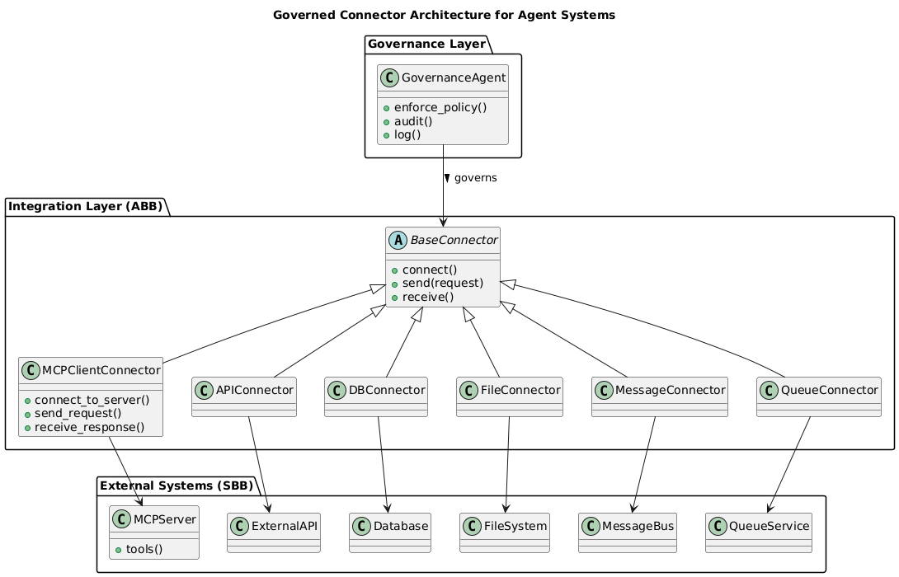

# External Connector Architecture

This document illustrates a connector-based integration architecture commonly used in enterprise AI and agentic systems.

The diagram demonstrates how agents access external systems through a standardized connector layer while governance controls and policies are enforced at the integration boundary.

This architecture reflects the approach used in K9-AIF for managing integrations with external services, APIs, databases, and messaging systems.

The design builds upon well-known software architecture concepts including:

- Adapter Pattern
- Connector Pattern
- Integration Layer architectures
- Policy Enforcement / Governance boundaries

Rather than introducing a new design pattern, this diagram shows how these established architectural concepts can be applied in modern agentic AI systems.

---

## Architectural Intent

Agent systems frequently interact with multiple external services such as:

- APIs
- Databases
- File systems
- Message buses
- Queue systems
- external tools and services

Direct access to these systems from agents leads to tight coupling and inconsistent control.

The connector layer provides a controlled integration boundary where:

- external systems are abstracted through connectors
- governance policies can be enforced
- integrations remain extensible and modular

---

## Structure

The architecture contains three primary layers.

### 1. Agent Layer

Agents request capabilities without needing to know how external systems are implemented.

---

Agent -> Connector abstraction

This keeps agent logic independent of specific external technologies.

---

### 2. Connector Layer

The connector layer defines a base abstraction (`BaseConnector`) that standardizes how integrations are implemented.

Concrete connectors inherit from this base class, including:

- API connectors
- database connectors
- file connectors
- messaging connectors
- queue connectors
- MCP tool connectors

Each connector encapsulates the logic required to communicate with a specific external system.

---

### 3. Governance Layer

Governance is applied at the connector boundary to enforce enterprise policies such as:

- authentication
- authorization
- auditing
- monitoring
- policy enforcement

This ensures that external integrations follow controlled access patterns.

---

## Class Diagram

---

## Benefits

This architecture provides several advantages for enterprise agent systems.

**Decoupling**

Agents do not depend on specific external technologies.

**Governance enforcement**

Security and operational policies are enforced at the integration boundary.

**Extensibility**

New connectors can be added without modifying agent logic.

**Consistency**

All external integrations follow a standardized connector contract.

**Technology independence**

The architecture supports multiple external systems while maintaining a unified interface.

---

## Relationship to Other Patterns

This architecture combines ideas from several established patterns:

| Pattern | Role |
|------|------|
Adapter Pattern | Adapts external systems to a common interface |
Connector Pattern | Standardizes external integrations |
Gateway Pattern | Controls access to external services |
Policy Enforcement Point | Applies governance at the integration boundary |

---

## Usage in Agent Architectures

Connector-based integration layers are particularly important in agent platforms where agents must interact with diverse external systems.

Examples include:

- LLM tool integrations
- MCP servers
- API services
- databases
- messaging infrastructure
- external enterprise systems

By routing these integrations through governed connectors, agent platforms can maintain both flexibility and operational control.

---

## Status

Architecture reference used within the K9-AIF ecosystem.
