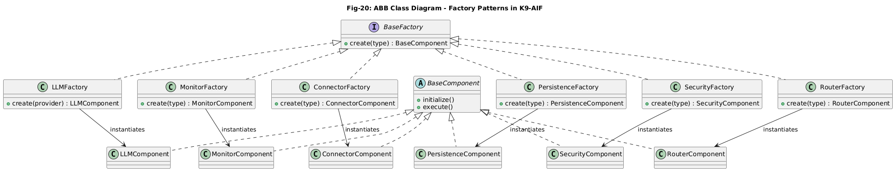

# Factory Pattern (LLM Provider Example)

This pattern demonstrates the Factory Pattern applied to LLM provider selection in an agentic system.

The example shows how a client application can dynamically select and instantiate an LLM provider based on configuration while remaining decoupled from concrete provider implementations.

The implementation follows principles used in the K9-AIF architecture, including:
- configuration-driven runtime composition
- separation of concerns
- governed extensibility

---

## Pattern Intent

Encapsulate object creation behind a factory so that the client code does not depend on concrete classes.

The client requests a provider by name, and the factory returns the appropriate implementation.

This allows:

- runtime provider selection
- simplified client logic
- controlled extensibility for new providers

---

## Class Diagram

