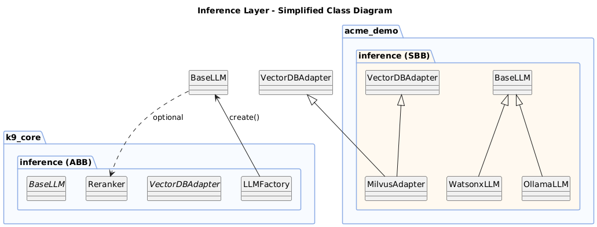

# Inference Layer Pattern (LLM Abstraction)

This pattern demonstrates an architectural approach for building a **provider-independent inference layer** in AI applications.

The design separates **architectural contracts (ABBs)** from **implementation-specific components (SBBs)**, allowing AI systems to support multiple inference providers without coupling application logic to a specific vendor or framework.

The example reflects architectural principles used in the **K9-AIF architecture**, including:

- separation of architectural contracts from implementations
- provider-independent inference interfaces
- configuration-driven runtime composition
- extensible integration of inference services

---

## Pattern Intent

Define a stable architectural abstraction for inference capabilities while allowing multiple concrete implementations to be substituted at runtime.

This allows:

- inference providers to be swapped without modifying application logic
- systems to integrate multiple LLM vendors
- architecture to remain stable even as model providers evolve

---

## Class Diagram



---

## Architectural Structure

The pattern separates components into two architectural layers:

### Architecture Building Blocks (ABB)

These represent **stable architectural contracts** that define inference capabilities.

Examples include:

- `BaseLLM`
- `VectorDBAdapter`
- `Reranker`
- `LLMFactory`

These components define **interfaces and responsibilities**, but do not depend on a specific provider.

---

### Solution Building Blocks (SBB)

These represent **concrete implementations** that fulfill the ABB contracts.

Examples include:

- `WatsonxLLM`
- `OllamaLLM`
- `MilvusAdapter`

These components provide the actual implementation logic while conforming to the architectural contracts defined in the ABB layer.

---

## Runtime Polymorphism

The client interacts only with the abstract inference interface:

```python
llm = factory.create(provider)
response = llm.infer(prompt)

```

The client code remains unchanged because it depends only on the abstract inference interface.
