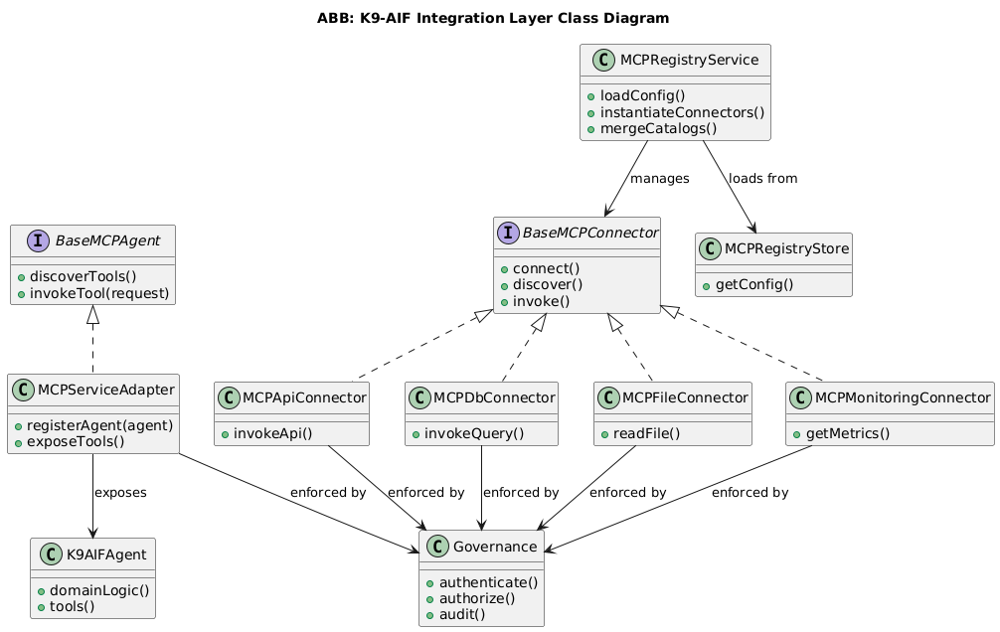

# MCP Connector Pattern

This pattern demonstrates how AI systems can integrate external services through a **connector abstraction layer** while maintaining architectural control, governance, and extensibility.

The pattern introduces a **connector-based integration architecture** where agents interact with external systems through standardized connectors instead of directly calling APIs, databases, or files.

This design reflects integration principles used in the **K9-AIF architecture**, including:

- controlled integration with external systems
- separation of integration logic from agent logic
- governance enforcement for all external interactions
- extensible connector architecture

---

## Pattern Intent

Provide a **standardized connector framework** that allows agents to access external systems through governed interfaces.

The pattern ensures that:

- agents remain independent of specific integration mechanisms
- external services can be added without modifying agents
- governance policies can be applied consistently across integrations

---

## Class Diagram

---

## Architectural Structure

The pattern introduces several key architectural components.

### MCPRegistryService

The registry service manages connector configuration and lifecycle.

Responsibilities include:

- loading connector configuration
- instantiating connectors
- merging connector catalogs

This allows connectors to be dynamically discovered and managed.

---

### BaseMCPConnector

`BaseMCPConnector` defines the common interface for all connectors.

Typical responsibilities include:

- establishing connections
- discovering available tools
- invoking operations

Concrete connectors extend this base class to integrate specific systems.

---

### Connector Implementations

Concrete connectors provide integration with different external systems.

Examples include:

- **MCPApiConnector** – integration with REST or HTTP services  
- **MCPDbConnector** – database access  
- **MCPFileConnector** – file system interaction  
- **MCPMonitoringConnector** – monitoring and metrics services  

Each implementation encapsulates the protocol and communication logic required to interact with the external system.

---

### MCPServiceAdapter

The `MCPServiceAdapter` acts as the bridge between agents and the connector layer.

Responsibilities include:

- registering agents
- exposing available tools
- routing tool invocations to connectors

This allows agents to access external services through a consistent interface.

---

### Governance

All connector operations pass through a **governance layer** responsible for enforcing policies such as:

- authentication
- authorization
- auditing

This ensures that integration points remain secure and compliant with enterprise policies.

---

### K9AIFAgent

Agents contain domain-specific logic and rely on connectors to access external capabilities.

Agents do not directly interact with external systems.  
Instead, they request tools exposed through the connector layer.

---

## Key Architectural Ideas

### Decoupled Integration

Agents are decoupled from integration details.  
Connectors encapsulate the logic required to communicate with external systems.

---

### Governed Access

All external interactions pass through governance controls to enforce security, policy, and auditing.

---

### Extensible Connector Framework

New connectors can be added without modifying existing agents.

Organizations can integrate additional services simply by implementing new connector types.

---

## Relationship to K9-AIF

In **K9-AIF**, the integration layer provides a structured mechanism for connecting agents to external systems.

Connectors function as **Solution Building Blocks (SBBs)** that implement standardized integration contracts defined by the architecture.

This allows agentic systems to evolve while maintaining controlled and governed integration with enterprise services.

---

## Status

Conceptual architectural pattern demonstrating a governed connector architecture for agent-based systems.
