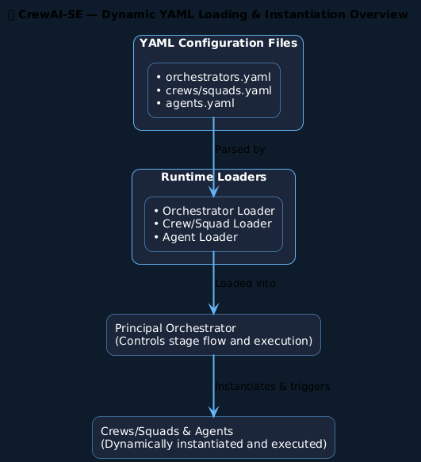

# Runtime Agent Loader Pattern

This document describes a configuration-driven runtime loading architecture used to dynamically instantiate agents and orchestration components from declarative configuration files.

The pattern enables AI and agent platforms to separate **system configuration** from **runtime execution**, allowing orchestration structures to be modified without changing application code.

This approach is used in the CrewAI-SE runtime architecture within the K9-AIF ecosystem.

---

## Architectural Intent

Agent platforms often require the ability to define:

- orchestration pipelines
- agent roles
- squads or crews
- execution stages

Hard-coding these structures in application code reduces flexibility and makes systems difficult to adapt.

The Runtime Agent Loader Pattern enables these structures to be defined through configuration files and instantiated dynamically at runtime.

---

## Configuration Files

The runtime system reads structured configuration files describing the orchestration components.

Typical configuration files include:

``` code
orchestrators.yaml
crews.yaml / squads.yaml
agents.yaml
```

These files define:

- orchestrator definitions
- crew or squad composition
- agent capabilities and roles

---

## Runtime Loaders

Dedicated loader components parse configuration files and construct the corresponding runtime objects.

Examples include:

- **Orchestrator Loader**
- **Crew / Squad Loader**
- **Agent Loader**

Each loader is responsible for converting configuration definitions into executable runtime components.

---

## Principal Orchestrator

Once configuration has been parsed and loaded, the runtime components are registered with the **Principal Orchestrator**.

The Principal Orchestrator:

- controls the execution pipeline
- manages stage transitions
- coordinates agent execution
- triggers crew or squad workflows

---

## Dynamic Instantiation

Agents and crews are instantiated dynamically based on the configuration model.

Configuration → Loader → Runtime Objects → Execution

This allows the orchestration structure to evolve without requiring code modifications.

---

## Architecture Flow

The diagram below illustrates the configuration-driven loading process.



---

## Benefits

### Configuration-Driven Architecture

System behavior can be modified by editing configuration files rather than application code.

---

### Runtime Flexibility

Agents, crews, and orchestration structures can be added or modified without redeploying the platform.

---

### Separation of Concerns

Execution logic is separated from system configuration.

---

### Extensibility

New agent types, orchestration stages, and crew structures can be introduced without changing the core runtime engine.

---

## Relationship to Established Patterns

This architecture combines concepts from several well-known patterns.

| Pattern | Role |
|------|------|
Factory Pattern | Instantiates runtime objects |
Dependency Injection | Provides runtime configuration |
Configuration-Driven Systems | Externalizes system behavior |
Orchestrator Pattern | Controls workflow execution |

---

## Usage in Agent Platforms

Configuration-driven loading architectures are common in modern AI orchestration systems, including:

- agent orchestration frameworks
- workflow engines
- distributed task platforms
- multi-agent coordination systems

They allow complex agent ecosystems to evolve without frequent changes to the runtime engine.

---

## Status

Architecture reference used within the K9-AIF agent orchestration framework.

